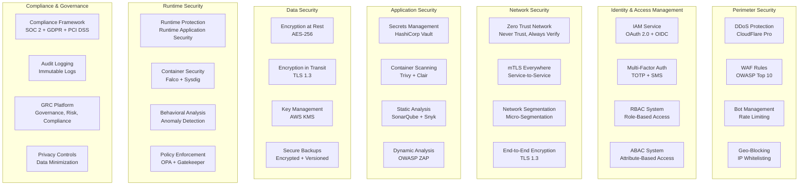
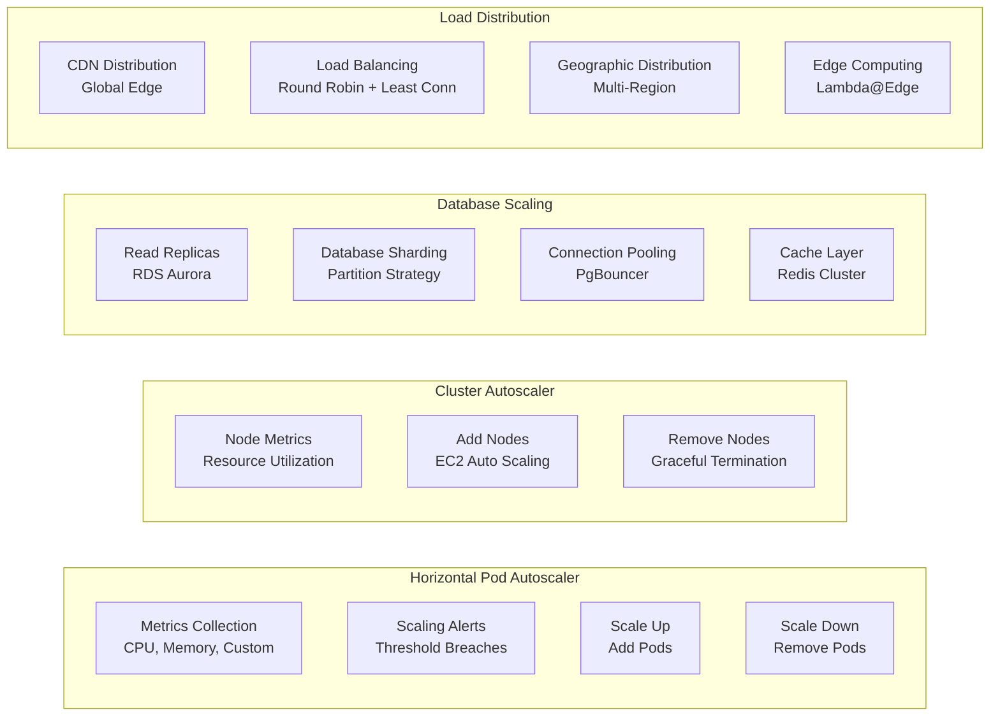
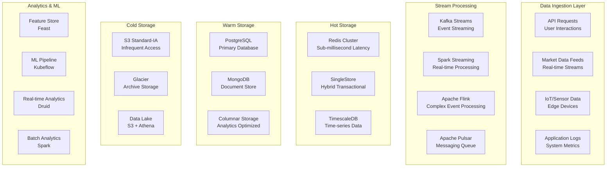
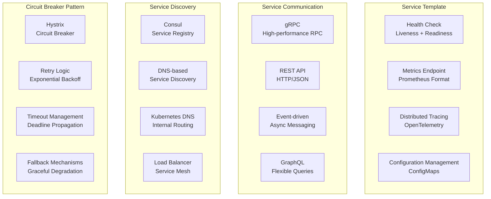
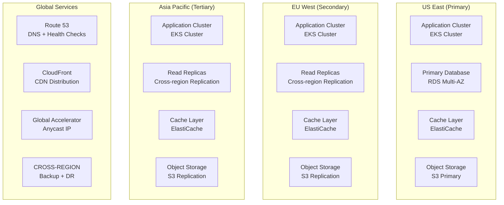
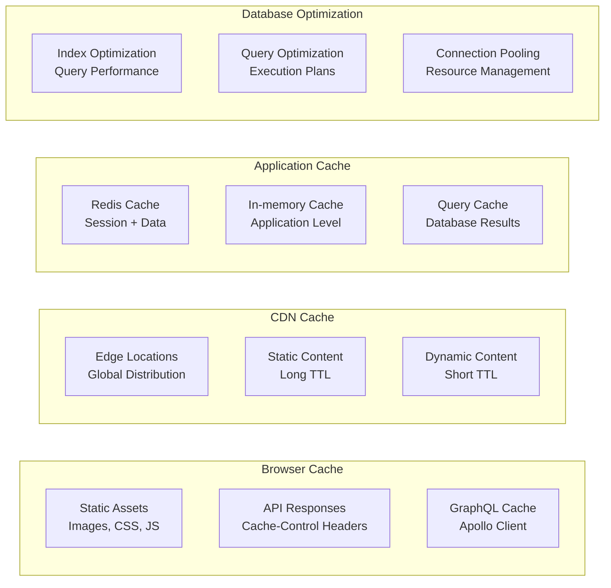

# AI-Powered Trading & Chat Platform 

## 🏗️ High-Level Architecture Overview

```mermaid
graph TB
    subgraph "Client Layer"
        WEB[Web Application<br/>Next.js + React]
        MOBILE[Mobile App<br/>React Native]
        DESKTOP[Desktop App<br/>Electron]
    end

    subgraph "CDN & Edge Layer"
        CF[CloudFlare CDN<br/>Global Edge Locations]
        WAF[Web Application Firewall<br/>DDoS Protection]
        LB[Load Balancer<br/>SSL Termination]
    end

    subgraph "API Gateway Layer"
        APIGW[API Gateway<br/>Kong / AWS API Gateway]
        AUTH[Authentication Service<br/>OAuth 2.0 + JWT]
        RATE[Rate Limiting<br/>Throttling]
        CACHE[API Response Cache<br/>Redis]
    end

    subgraph "Service Mesh Layer"
        ISTIO[Istio Service Mesh<br/>mTLS + Traffic Management]
        ENVOY[Envoy Proxy<br/>Sidecar Containers]
        TRACING[Distributed Tracing<br/>Jaeger]
    end

    subgraph "Application Services Layer"
        subgraph "Core Services"
            CHAT[Chat Service<br/>Node.js + Socket.io]
            AI[AI Service<br/>Python + FastAPI<br/>ML Models]
            TRADING[Trading Service<br/>Node.js + Express]
            USER[User Service<br/>Node.js + Express]
        end
        
        subgraph "Support Services"
            NOTIFICATION[Notification Service<br/>Go + Kafka]
            FILE[File Service<br/>Node.js + S3]
            ANALYTICS[Analytics Service<br/>Python + Spark]
            COMMUNITY[Community Service<br/>Node.js + Express]
        end
    end

    subgraph "Data Layer"
        subgraph "Primary Databases"
            PG[(PostgreSQL<br/>Primary Database<br/>RDS Multi-AZ)]
            MONGO[(MongoDB<br/>Document Store<br/>Atlas Cluster)]
            REDIS[(Redis<br/>Cache + Session<br/>ElastiCache)]
        end
        
        subgraph "Data Processing"
            KAFKA[Apache Kafka<br/>Event Streaming]
            SPARK[Apache Spark<br/>Big Data Processing]
            ELASTIC[(Elasticsearch<br/>Search & Analytics)]
        end
        
        subgraph "Object Storage"
            S3[(AWS S3<br/>File Storage)]
            GLACIER[(AWS Glacier<br/>Archive Storage)]
        end
    end

    subgraph "AI/ML Platform"
        subgraph "Model Serving"
            TFSERVING[TensorFlow Serving<br/>Model Deployment]
            TORCH[PyTorch Serve<br/>Model Inference]
            SAGEMAKER[AWS SageMaker<br/>ML Pipeline]
        end
        
        subgraph "Model Training"
            KUBEFLOW[Kubeflow<br/>ML Workflow]
            MLFLOW[MLflow<br/>Model Registry]
            FEATURE[Feature Store<br/>Feast]
        end
        
        subgraph "External AI APIs"
            OPENAI[OpenAI GPT-4<br/>Language Models]
            ANTHROPIC[Anthropic Claude<br/>Reasoning Models]
            GOOGLE[Google Gemini<br/>Vision Models]
            HUGGING[Hugging Face<br/>Specialized Models]
        end
    end

    subgraph "External Services"
        MARKET_DATA[Market Data APIs<br/>Alpha Vantage, Yahoo Finance]
        NEWS[News APIs<br/>NewsAPI, Bloomberg]
        PAYMENT[Payment Gateway<br/>Stripe, PayPal]
        SMS[SMS Gateway<br/>Twilio]
        EMAIL[Email Service<br/>SendGrid]
    end

    subgraph "Security Layer"
        subgraph "Network Security"
            VPC[AWS VPC<br/>Network Isolation]
            SG[Security Groups<br/>Firewall Rules]
            NACL[Network ACLs<br/>Subnet Protection]
            VPN[VPN Gateway<br/>Secure Access]
        end
        
        subgraph "Application Security"
            VAULT[HashiCorp Vault<br/>Secrets Management]
            CEREBRO[Cerebro<br/>Certificate Management]
            OPA[Open Policy Agent<br/>Authorization]
            FALCO[Falco<br/>Runtime Security]
        end
        
        subgraph "Monitoring Security"
            GUARDDUTY[AWS GuardDuty<br/>Threat Detection]
            SECURITYHUB[AWS Security Hub<br/>Compliance]
            CLOUDTRAIL[AWS CloudTrail<br/>Audit Logs]
            INSPECTOR[AWS Inspector<br/>Vulnerability Scan]
        end
    end

    subgraph "DevOps & Monitoring"
        subgraph "Container Orchestration"
            K8S[Kubernetes Cluster<br/>EKS Managed]
            HELM[Helm Charts<br/>Package Management]
            ARGOCD[ArgoCD<br/>GitOps Deployment]
        end
        
        subgraph "CI/CD Pipeline"
            GITHUB[GitHub Actions<br/>CI/CD Pipeline]
            JENKINS[Jenkins<br/>Build Automation]
            SONAR[SonarQube<br/>Code Quality]
            SNYK[Snyk<br/>Security Scanning]
        end
        
        subgraph "Observability"
            PROMETHEUS[Prometheus<br/>Metrics Collection]
            GRAFANA[Grafana<br/>Visualization]
            JAEGER[Jaeger<br/>Distributed Tracing]
            ELK[ELK Stack<br/>Log Aggregation]
        end
    end

    WEB --> CF
    MOBILE --> CF
    DESKTOP --> CF
    
    CF --> WAF
    WAF --> LB
    LB --> APIGW
    
    APIGW --> AUTH
    APIGW --> RATE
    APIGW --> CACHE
    
    AUTH --> ISTIO
    ISTIO --> ENVOY
    
    ENVOY --> CHAT
    ENVOY --> AI
    ENVOY --> TRADING
    ENVOY --> USER
    ENVOY --> NOTIFICATION
    ENVOY --> FILE
    ENVOY --> ANALYTICS
    ENVOY --> COMMUNITY
    
    CHAT --> PG
    CHAT --> REDIS
    CHAT --> KAFKA
    
    AI --> TFSERVING
    AI --> TORCH
    AI --> SAGEMAKER
    AI --> OPENAI
    AI --> ANTHROPIC
    AI --> GOOGLE
    AI --> HUGGING
    
    TRADING --> PG
    TRADING --> MONGO
    TRADING --> MARKET_DATA
    TRADING --> NEWS
    
    USER --> PG
    USER --> REDIS
    
    NOTIFICATION --> KAFKA
    NOTIFICATION --> SMS
    NOTIFICATION --> EMAIL
    
    FILE --> S3
    FILE --> GLACIER
    
    ANALYTICS --> SPARK
    ANALYTICS --> ELASTIC
    ANALYTICS --> MONGO
    
    COMMUNITY --> PG
    COMMUNITY --> ELASTIC
    
    K8S --> HELM
    K8S --> ARGOCD
    
    PROMETHEUS --> GRAFANA
    JAEGER --> GRAFANA
    ELK --> GRAFANA
```

## 🔒 Security Architecture - Zero Trust Model

### Multi-Layer Security Approach

## 🚀 Scalability Architecture

### Auto-Scaling Strategy

## 📊 High-Performance Data Architecture

### Data Flow Architecture

## 🔧 Modular Service Architecture

### Service Independence Pattern

## 🌐 Multi-Region Deployment Strategy

### Global Distribution Architecture

## 📈 Performance Optimization Strategy

### Caching Hierarchy

## 🎯 Key Architecture Benefits

### 1. **High Availability (99.99% Uptime)**
- Multi-region deployment with automatic failover
- Health checks and circuit breakers
- Graceful degradation patterns
- Disaster recovery procedures

### 2. **Scalability (Handle 1M+ Concurrent Users)**
- Horizontal pod autoscaling
- Database read replicas and sharding
- Event-driven architecture
- Caching at multiple levels

### 3. **Security (Zero Trust Model)**
- End-to-end encryption
- mTLS for service-to-service communication
- Runtime security monitoring
- Compliance with financial regulations

### 4. **Performance (Sub-second Response Time)**
- Edge computing with CDN
- In-memory caching
- Optimized database queries
- Asynchronous processing

### 5. **Flexibility & Extensibility**
- Microservices architecture
- API-first design
- Event-driven communication
- Plugin-based architecture

### 6. **Cost Optimization**
- Auto-scaling based on demand
- Spot instances for non-critical workloads
- Intelligent data tiering
- Resource optimization

This architecture provides a robust, scalable, and secure foundation for your AI-powered trading platform, capable of handling high traffic while maintaining excellent performance and security standards.
